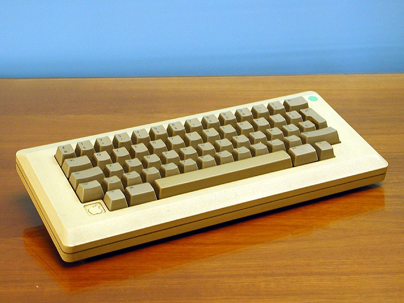

## (Neo)Vim
**The best editor for servers and fast edits**

---
## Intro
- [20 Minutes] Basics / Some features
- [50 Minutes] You use vim
- [5 Minutes] Configuration
- [5 Minutes] Neovim
- [10 Minutes] End / My Config / QA
---
## HELP!
* **:help [identifier]**
---
## Basics - Navigation
- h, j, k , l
- H, M, L
- CTRL + d ; CTRL + b
- zz => Center
- gg, G
- [Demo]
---
## Basics - Navigation



---
## Basics - Grammar


---
## Basics - Grammar
- operator => d, c
- count => 5
- motion => w, b, paragraph, s, ", b, {, t
---
## Basics - Modes
- INSERT (i/A/I/o/O)
- COMMAND (:)
- NORMAL (ESC)
- VISUAL (v/V/CTRL-V)
- REPLACE (R)
---
## Basics - How to quit
* :q
* :q!
* :qa
* :qa!
* :x
* :x!
---

### Basics - History/Save
- u [undo]
- CTRL + r [redo]
- :w [save]
---
## Basics - Keybindings

```vim
map <leader>l :tabn
map <leader>r :tabp

vmap <leader>l :tabp
vmap <leader>r :tabn
```
---
## Find
- t [till]
- f [find]
---
## Vim Hogwards

**Some features I would consider more than basic**

---
## Marks


---
### Marks (Setting / Reading)
* set with **m** and an identifier
* a-z are local identifiers
* A-Z are global identifiers
* jump to with **'** and an identifier
---
## Using Marks

[Demo]

---
## Registers
1. The unnamed register ""
2. 10 numbered registers "0 to "9
3. The small delete register "-
4. 26 named registers "a to "z or "A to "Z
5. Three read-only registers ":, "., "%
---
## Using Registers
- :reg a
- "[register_name][operation]
- "[register]yy

---
## Macros
- **A macro is recorded by pressing 'q' followed by a register 'a'**
- **A macro can be used by pressing '@' followed by a register 'a'**
- **You can run a macro 'n' times with [count]@[register]**
---
## Search and Replace
- :%s/foo/bar/g [replace on current line]
- :s/foo/bar/g [replace in all lines]
- :s/\<foo>/bar/g [replace exactly]
- :s/foo/bar/gI [replace case insensitive]
- :s/foo/bar/gc [replace with confirm]
---
## Sorting

### Sort - [Normal]
- :sort

### Sort - [With options]
- :sort ! [reverse order]
- :sort i [case is ignored]
- :sort l [use the current language]
- :sort n [first decimal number]

---
## Visual Block Mode
- Well it's visual

---

## Its time!

DO IT YOURSELF!

- git clone https://github.com/Liberatys/lw_vim

---
## Configuration
- https://github.com/Liberatys/dotfiles
---
## Neovim
- A modern version of vim
- Decoupled ui from 'core'
- Threading
- Lua integration
- Terminal
---
## My Config
- https://github.com/Liberatys/dotfiles
---
## QA
---
## Done!

Thank you :D 
